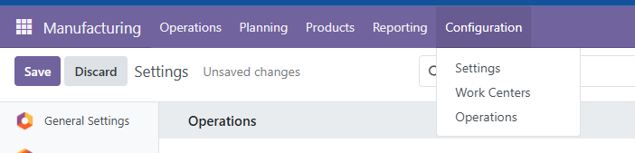
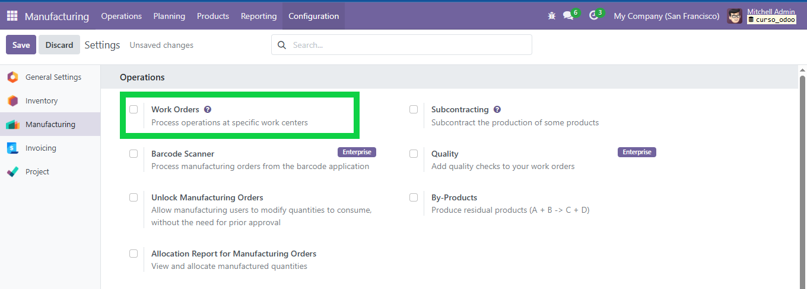
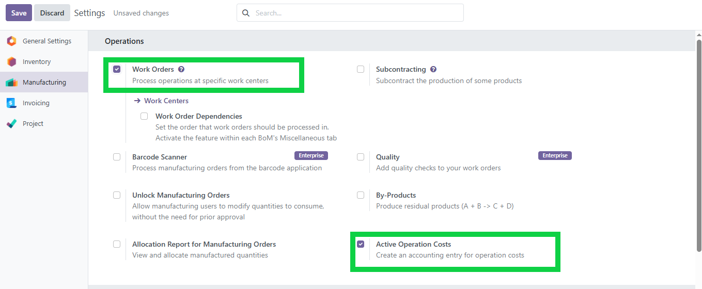

MRP Cost 
========

This module extends the functionality of Odoo ``mrp_account`` module by creating accounting entries for the additional costs of operations in manufacturing orders.

Configuration
-------------

To configure this module, go to ``Manufacturing > Configuration > Settings``. There, enable the ``Work Orders`` option. Once selected, the ``Active Operation Costs`` checkbox will appear and must also be enabled.

Bug Tracker
-----------

Bugs are tracked on `GitHub Issues <https://github.com/TU_REPOSITORIO_GITHUB/issues>`_.
If you find a bug, please report it with detailed steps to reproduce the issue.

Credits
-------

Authors
~~~~~~~

.. image:: https://d-3system.com.au/wp-content/uploads/2020/05/Dimension3_Systems_460x159.png.webp
   :width: 25%
   :alt: Dimension 3 systems
   :target: https://d-3system.com.au/

Contributors
~~~~~~~~~~~~

* Juan Pablo Arcos

Maintainers
~~~~~~~~~~~

This module is maintained by your team or organization.

.. image:: https://d-3system.com.au/wp-content/uploads/2020/05/Dimension3_Systems_460x159.png.webp
   :width: 25%
   :alt: Dimension 3 systems
   :target: https://d-3system.com.au/

License
=======

Licensed under the LGPL v3.0 or later.  
This module is not part of an official OCA repository but follows OCA best development practices.
