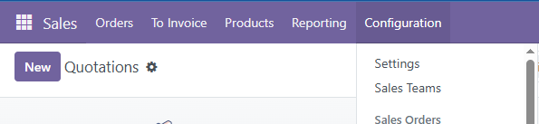
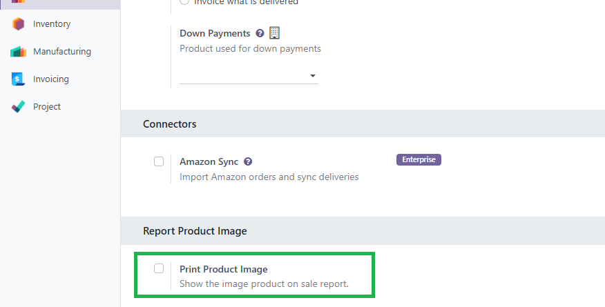
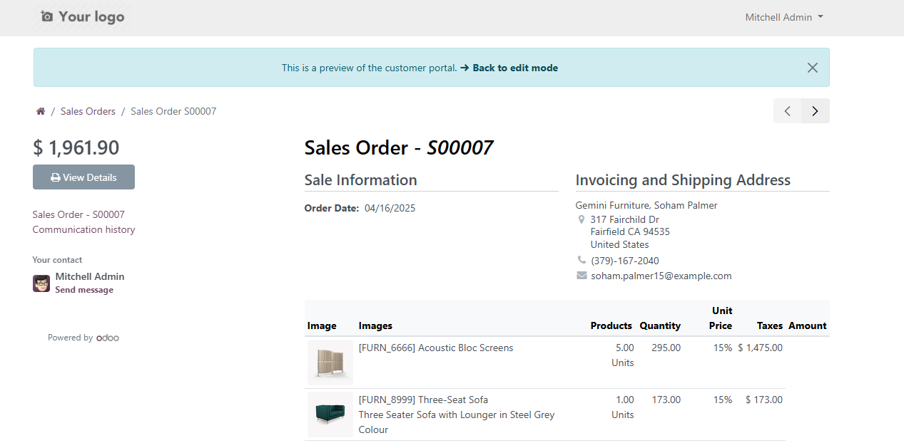

Product Image  
=============

This module extends the functionality of Odoo's ``sale_management`` module, allowing product images to be displayed both in the PDF sales report and on the customer portal.

Features
--------
           
- Displays the product image in the quotation/sales order PDF report.
- Adds the product image to the portal view for sales orders.
- Enhances the visual experience for customers when reviewing orders from the portal.

Configuration
-------------

To configure this module, go to ``Sales > Configuration > Settings``. There, enable the ``Print product image`` option.

Expected Result
---------------

If the module is correctly installed and configured, you should see the following:

- In the **PDF Sales Order**, each product line displays a thumbnail of the product image along with its description and quantity.
- In the **Customer Portal**, when opening a sales order, each line includes the corresponding product image.
- No errors occur when generating the PDF report or accessing the order from the portal.

Bug Tracker
-----------

Bugs are tracked on `GitHub Issues <https://github.com/TU_REPOSITORIO_GITHUB/issues>`_.
If you find a bug, please report it with detailed steps to reproduce the issue.

Credits
-------

Authors
~~~~~~~

.. image:: https://d-3system.com.au/wp-content/uploads/2020/05/Dimension3_Systems_460x159.png.webp
   :width: 25%
   :alt: Dimension 3 systems
   :target: https://d-3system.com.au/

Contributors
~~~~~~~~~~~~

* Juan Pablo Arcos

Maintainers
~~~~~~~~~~~

This module is maintained by your team or organization.

.. image:: https://d-3system.com.au/wp-content/uploads/2020/05/Dimension3_Systems_460x159.png.webp
   :width: 25%
   :alt: Dimension 3 systems
   :target: https://d-3system.com.au/

License
=======

Licensed under the LGPL v3.0 or later.  
This module is not part of an official OCA repository but follows OCA best development practices.
