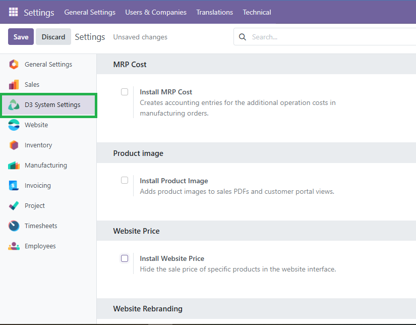

D3 System Code
==============

This module adds a **D3 System Settings** section in the general configuration of Odoo, where users can view, enable, and install optional modules from the D3 suite directly.

Usage
=====

1. Go to **Settings** > **D3 System Settings**
2. Enable the features you want by checking the corresponding options.
3. Save the settings to automatically install the selected modules.

Each option represents an installable D3 module ( product image, MRP cost , etc.).

   
Bug Tracker
-----------

Bugs are tracked on `GitHub Issues <https://github.com/TU_REPOSITORIO_GITHUB/issues>`_.
If you find a bug, please report it with detailed steps to reproduce the issue.

Credits
-------

Authors
~~~~~~~

.. image:: https://d-3system.com.au/wp-content/uploads/2020/05/Dimension3_Systems_460x159.png.webp
   :width: 25%
   :alt: Dimension 3 systems
   :target: https://d-3system.com.au/

Contributors
~~~~~~~~~~~~

* Juan Pablo Arcos

Maintainers
~~~~~~~~~~~

This module is maintained by your team or organization.

.. image:: https://d-3system.com.au/wp-content/uploads/2020/05/Dimension3_Systems_460x159.png.webp
   :width: 25%
   :alt: Dimension 3 systems
   :target: https://d-3system.com.au/

License
=======

Licensed under the LGPL v3.0 or later.  
This module is not part of an official OCA repository but follows OCA best development practices.
