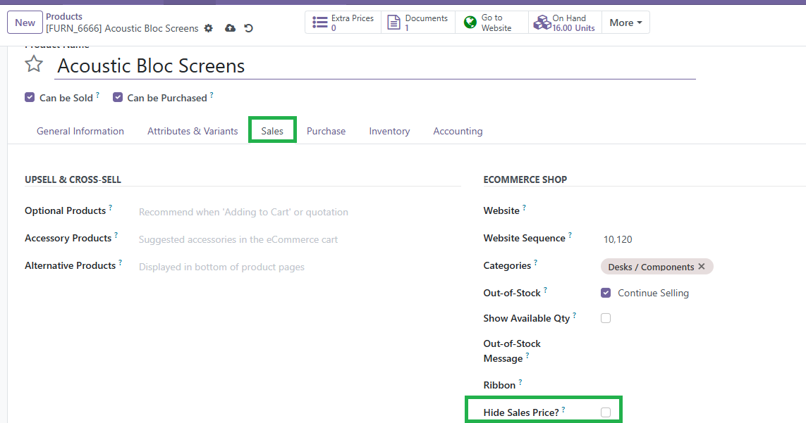
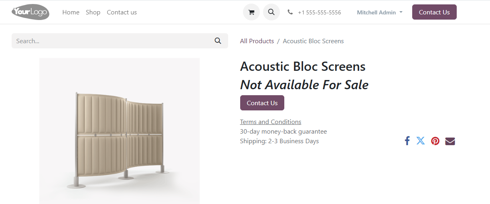

Website Price
=============
    
This module extends the functionality of Odoo ``website_sale`` module. It allows you to hide the sales price of specific products on the website's frontend.

Usage
-----

- Go to ``Sales > Products > Products``.
- Open the product form and enable the ``Hide Sales Price`` option.
- The product's price will no longer be displayed on the website for users.

Bug Tracker
-----------

Bugs are tracked on `GitHub Issues <https://github.com/TU_REPOSITORIO_GITHUB/issues>`_.
If you find a bug, please report it with detailed steps to reproduce the issue.

Credits
-------

Authors
~~~~~~~

.. image:: https://d-3system.com.au/wp-content/uploads/2020/05/Dimension3_Systems_460x159.png.webp
   :width: 25%
   :alt: Dimension 3 systems
   :target: https://d-3system.com.au/

Contributors
~~~~~~~~~~~~

* Juan Pablo Arcos

Maintainers
~~~~~~~~~~~

This module is maintained by your team or organization.

.. image:: https://d-3system.com.au/wp-content/uploads/2020/05/Dimension3_Systems_460x159.png.webp
   :width: 25%
   :alt: Dimension 3 systems
   :target: https://d-3system.com.au/

License
=======

Licensed under the LGPL v3.0 or later.  
This module is not part of an official OCA repository but follows OCA best development practices.
