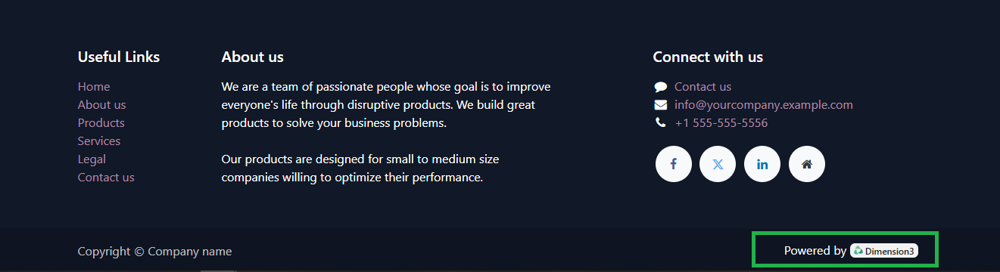

Website Rebranding
==================

This module extends the functionality of Odoo ``website_sale`` and ``mail`` modules. It is designed to perform a complete rebranding of the Odoo system, with the goal of replacing Odoo's default branding (such as "Powered by Odoo") with Dimension3's custom branding on the website and email templates. This module makes it easy to customize the visual and textual elements of the website and outgoing emails, without needing to manually edit the code.

Features
---------------

- **Automation:** Runs automatically every 12 months to keep the branding clean.
- **Customization:** Allows customization of logos, text, and links on the website and emails.

Bug Tracker
-----------

Bugs are tracked on `GitHub Issues <https://github.com/TU_REPOSITORIO_GITHUB/issues>`_.
If you find a bug, please report it with detailed steps to reproduce the issue.

Credits
-------

Authors
~~~~~~~

.. image:: https://d-3system.com.au/wp-content/uploads/2020/05/Dimension3_Systems_460x159.png.webp
   :width: 25%
   :alt: Dimension 3 systems
   :target: https://d-3system.com.au/

Contributors
~~~~~~~~~~~~

* Juan Pablo Arcos

Maintainers
~~~~~~~~~~~

This module is maintained by your team or organization.

.. image:: https://d-3system.com.au/wp-content/uploads/2020/05/Dimension3_Systems_460x159.png.webp
   :width: 25%
   :alt: Dimension 3 systems
   :target: https://d-3system.com.au/

License
=======

Licensed under the LGPL v3.0 or later.  
This module is not part of an official OCA repository but follows OCA best development practices.
